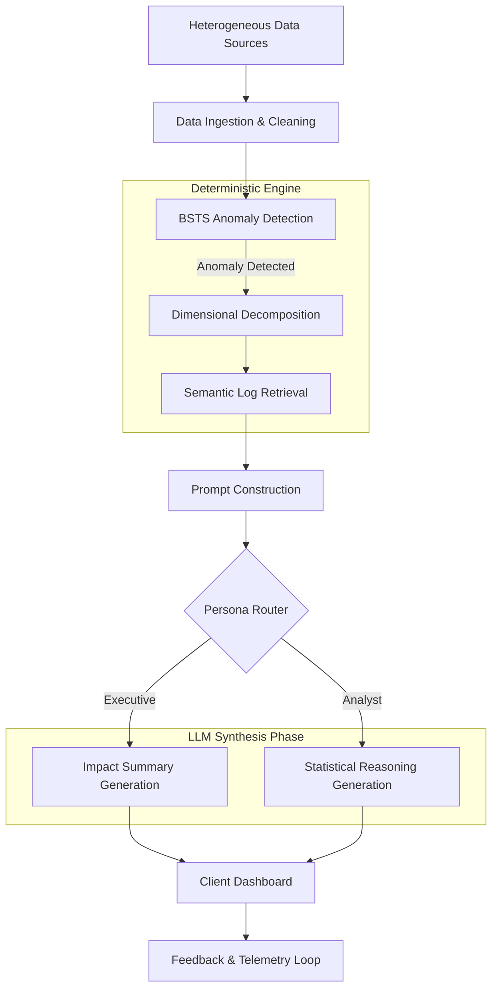
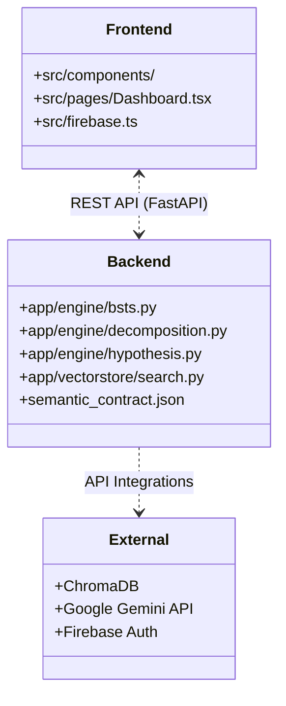

# Trace.ai: KPI Intelligence-to-Action Engine

Trace.ai is an intelligent observability and root-cause analysis platform built to directly address the requirements of the **BusinessIntelligence.ai Round 2** evaluation. It automates the detection of material KPI movements, reconciles heterogeneous data sources via semantic contracts, and instantly generates persona-specific hypotheses (with actionable recommendations) grounded in deterministic evidence.

---

## Alignment with Round 2 Objectives

Trace.ai explicitly satisfies the prototype expectations through a hybrid architecture that separates deterministic quantitative analysis from LLM-driven narrative synthesis:

1. **Detects and Prioritizes Material Movements:** Uses Bayesian Structural Time Series (BSTS) via `statsmodels` to robustly detect anomalies (filtering seasonality and noise), prioritizing them by statistical deviation and business impact.
2. **Reconciles Data and Context:** Driven by a lightweight `semantic_contract.json` that defines KPI definitions, hierarchies, business rules, and thresholds across varying grains.
3. **Identifies and Ranks Drivers:** Employs a deterministic decomposition engine (`decomposition.py`) to slice anomalous KPIs by dimensions (Region, Device, Channel) and rank the exact sub-segments driving the issue.
4. **Persona-Specific Narratives:** Synthesizes different insights dynamically. The *Executive* persona receives plain-language business impact summaries, while the *Analyst* persona receives full statistical reasoning, p-values, and query paths.
5. **Communicates Uncertainty and Abstains:** The engine evaluates evidence deterministically. If rules-based checks yield weak correlations or if sparse historical data is detected, the engine abstains or flags `INSUFFICIENT` confidence, requesting human clarification.
6. **Actionable Recommendations:** Outputs highly structured next steps in the exact requested format: `Driver -> Lever -> Action -> Expected Impact`.
7. **Feedback and Learning Loop:** The UI includes analyst feedback mechanisms that capture human-in-the-loop validation for continuous evaluation.
8. **Security and Telemetry:** Features Firebase JWT role-based Row-Level Security (RLS) ensuring tenant isolation. Every LLM invocation tracks latency, token consumption, model choice, and estimated cost (saved to local telemetry).

---

## Architectural Philosophy: Non-LLM Quantitative Truth

**The Large Language Model is explicitly NOT treated as the source of quantitative truth.** Trace.ai strictly enforces the following boundary:

* **Statistics & Mathematics (Non-LLM):** BSTS anomaly detection, dimensional decomposition, and rule-based log correlation are entirely deterministic Python functions.
* **Semantic Search (Traditional ML):** Uses local Google GenAI embeddings stored in ChromaDB to retrieve relevant logs without hallucination.
* **Narrative Synthesis (LLM):** Google Gemini 1.5 is only provided the deterministic mathematical outputs and retrieved logs, constrained by strict System Prompts to synthesize the final explanation and action plan.

### System Workflow



---

## Solution Architecture

The repository is structured as a decoupled architecture containing distinct frontend and backend modules:



---

## Dependencies

### Backend
* **Python 3.10+**
* **FastAPI & Uvicorn:** High-performance async web framework.
* **Statsmodels & Pandas:** Deterministic time series analysis and data wrangling.
* **ChromaDB:** Local vector database for log storage.
* **Google GenAI API:** Embeddings and LLM synthesis.
* **Firebase Admin:** JWT validation and multi-tenant security.

### Frontend
* **Node.js 18+**
* **React 18 & Vite:** Fast frontend rendering.
* **TailwindCSS:** Utility-first styling system.
* **Recharts:** Interactive timeseries visualization.

---

## Execution Instructions

### 1. Backend Setup
Navigate to the backend directory:
```bash
cd backend
```
Create and activate a virtual environment:
```bash
python -m venv venv
# Windows
.\venv\Scripts\activate
# Mac/Linux
source venv/bin/activate
```
Install dependencies:
```bash
pip install -r requirements.txt
```
Create a `.env` file in the `backend/` directory to configure the engine:
```env
GEMINI_API_KEY=your_gemini_api_key_here
DEMO_MODE=true  
```
Start the API server:
```bash
python -m uvicorn app.main:app --reload --port 8000
```

### 2. Frontend Setup
Open a new terminal and navigate to the frontend directory:
```bash
cd frontend
```
Install node dependencies:
```bash
npm install
```
Create a `.env` file in the `frontend/` directory to connect to the backend:
```env
VITE_API_BASE_URL=http://localhost:8000
VITE_DEMO_MODE=true
```
Start the development server:
```bash
npm run dev
```
Open your browser to `http://localhost:5173`.

---

## Fulfilling the "Minimum Prototype Expectations" Checklist

- [x] **Connected KPIs and Heterogeneous Sources:** Frontend ingests CSV files combining disjointed telemetry, log traces, and financial metrics.
- [x] **Semantic Contract:** Fully implemented in `backend/semantic_contract.json` covering definitions and business rules.
- [x] **Two Personas:** Real-time toggle in the UI shifts the LLM pipeline between "Executive" (business-impact) and "Analyst" (statistical-rigor).
- [x] **Multi-Factor KPI Movement:** `decomposition.py` handles recursive splits to isolate multiple contributing sub-dimensions.
- [x] **Low-Confidence & Abstention:** Hard-coded thresholds flag `INSUFFICIENT` evidence dynamically when mathematical deviation bounds are not met, prompting the engine to request human clarity.
- [x] **Sparse-History Scenario:** Logic checks historical array lengths, overriding standard statistical checks with rules-based thresholds and tagging the anomaly with a "Sparse History" warning.
- [x] **Role-Based Security:** Backend `auth.py` validates Firebase JWTs, ensuring users only access their organization's traces (enforced when `DEMO_MODE=false`).
- [x] **LLM vs Non-LLM Separation:** Explicit architectural boundary enforcing mathematics for finding issues and LLMs exclusively for narrative synthesis.
- [x] **Runtime Telemetry:** The backend intercepts Google GenAI API calls, calculates exact token usage and latency, estimates USD cost, and logs telemetry.
