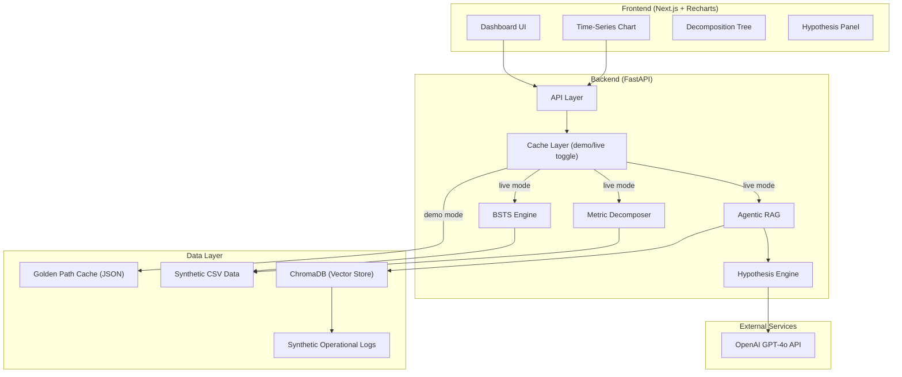
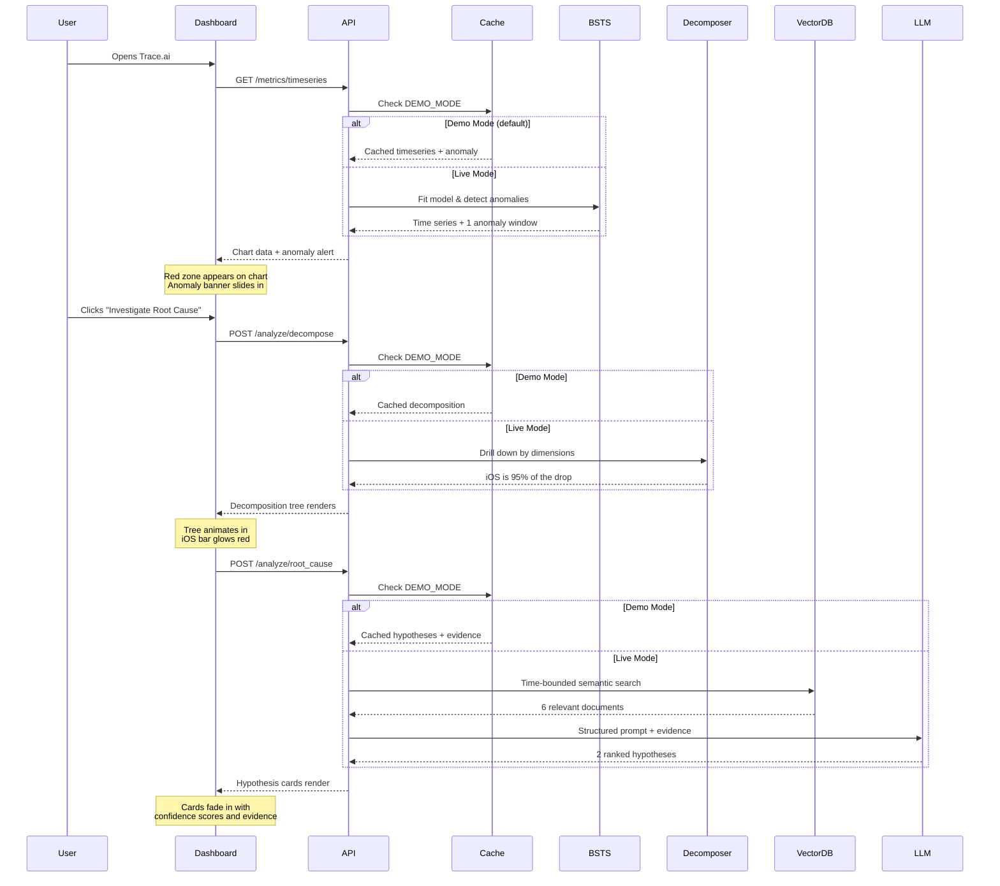
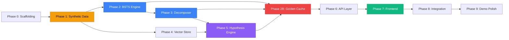

# Trace.ai — Complete Execution Plan (v2)
**The Competition-Winning Causal Engine for Business Intelligence**

> [!IMPORTANT]
> **v2 Changes from initial plan:** Golden path cache as first-class architecture (not an afterthought), realistic time estimates with 35% buffer, failure-mode handling prioritized over animation polish, defensible RAG query templates, trimmed EvidenceDrawer scope, and explicit Q&A prep.

---

## Architecture Overview



---

## Project Directory Structure

```
AIC/
├── backend/
│   ├── app/
│   │   ├── __init__.py
│   │   ├── main.py                  # FastAPI app entry point
│   │   ├── config.py                # Environment variables & settings
│   │   ├── models/
│   │   │   ├── __init__.py
│   │   │   ├── schemas.py           # Pydantic request/response models
│   │   │   └── hypothesis.py        # Hypothesis output schema
│   │   ├── routers/
│   │   │   ├── __init__.py
│   │   │   ├── metrics.py           # GET /api/v1/metrics/timeseries
│   │   │   ├── analyze.py           # POST /api/v1/analyze/decompose
│   │   │   └── root_cause.py        # POST /api/v1/analyze/root_cause
│   │   ├── engine/
│   │   │   ├── __init__.py
│   │   │   ├── bsts.py              # Bayesian Structural Time Series
│   │   │   ├── decomposer.py        # Deterministic metric decomposition
│   │   │   ├── rag.py               # Time-bounded vector search
│   │   │   └── hypothesis.py        # LLM hypothesis generation
│   │   ├── cache/
│   │   │   ├── __init__.py
│   │   │   ├── golden_path.py       # Cache manager (demo/live toggle)
│   │   │   └── generate_cache.py    # One-shot script to pre-run pipeline
│   │   ├── vectorstore/
│   │   │   ├── __init__.py
│   │   │   ├── ingest.py            # ChromaDB ingestion pipeline
│   │   │   └── search.py            # Time-bounded similarity search
│   │   └── utils/
│   │       ├── __init__.py
│   │       └── time_utils.py        # Timestamp parsing & windowing
│   ├── data/
│   │   ├── synthetic_metrics.csv    # Structured time-series data
│   │   ├── synthetic_logs.json      # Unstructured operational logs
│   │   ├── generate_data.py         # Data generation script
│   │   └── golden_cache/            # Pre-computed pipeline outputs
│   │       ├── timeseries.json      # Cached BSTS output
│   │       ├── decomposition.json   # Cached decomposition output
│   │       └── root_cause.json      # Cached LLM hypothesis output
│   ├── tests/
│   │   ├── test_bsts.py
│   │   ├── test_decomposer.py
│   │   ├── test_rag.py
│   │   └── test_failure_modes.py    # Degradation & edge-case tests
│   ├── requirements.txt
│   ├── .env.example
│   └── Dockerfile
├── frontend/
│   ├── src/
│   │   ├── app/
│   │   │   ├── layout.js
│   │   │   ├── page.js              # Main dashboard
│   │   │   └── globals.css
│   │   ├── components/
│   │   │   ├── Dashboard/
│   │   │   │   ├── TimeSeriesChart.jsx
│   │   │   │   ├── AnomalyBanner.jsx
│   │   │   │   └── MetricCards.jsx
│   │   │   ├── Analysis/
│   │   │   │   ├── DecompositionTree.jsx
│   │   │   │   ├── HypothesisPanel.jsx
│   │   │   │   └── EvidenceList.jsx  # Simplified from EvidenceDrawer
│   │   │   ├── States/
│   │   │   │   ├── EmptyState.jsx    # No anomaly found
│   │   │   │   ├── AmbiguousState.jsx # Multiple close drivers
│   │   │   │   └── ErrorState.jsx    # Backend/LLM failures
│   │   │   └── UI/
│   │   │       ├── Sidebar.jsx
│   │   │       ├── Header.jsx
│   │   │       └── LoadingStates.jsx
│   │   ├── hooks/
│   │   │   └── useTraceAPI.js
│   │   ├── lib/
│   │   │   └── api.js               # Axios/fetch wrapper
│   │   └── styles/
│   │       └── variables.css
│   ├── package.json
│   └── next.config.js
├── .gitignore
└── README.md
```

---

## Execution Phases

---

## Phase 0: Project Scaffolding & Environment Setup
**⏱ Estimated Time: 40–60 minutes**

### Step 0.1 — Initialize Git Repository
```bash
cd AIC
git init
```

### Step 0.2 — Backend Scaffolding
| Task | Detail |
|------|--------|
| Create `backend/` directory tree | All folders listed in the structure above, **including `cache/` and `data/golden_cache/`** |
| Create `requirements.txt` | See dependency list below |
| Create Python virtual environment | `python -m venv .venv` |
| Install dependencies | `pip install -r requirements.txt` |
| Create `.env.example` | `OPENAI_API_KEY=`, `CHROMA_PERSIST_DIR=./chroma_db`, `DEMO_MODE=true` |

**`requirements.txt`:**
```
fastapi==0.115.*
uvicorn[standard]==0.34.*
pydantic==2.*
python-dotenv==1.*
pandas==2.*
numpy==1.*
scipy==1.*
statsmodels==0.14.*
chromadb==0.6.*
openai==1.*
sentence-transformers==3.*
httpx==0.28.*
```

### Step 0.3 — Frontend Scaffolding
| Task | Detail |
|------|--------|
| Initialize Next.js app | `npx -y create-next-app@latest ./frontend` |
| Install charting library | `npm install recharts` |
| Install HTTP client | `npm install axios` |
| Install animation library | `npm install framer-motion` |
| Install icons | `npm install lucide-react` |

### Step 0.4 — Create `.gitignore`
```gitignore
__pycache__/
.venv/
.env
chroma_db/
node_modules/
.next/
```

> [!IMPORTANT]
> **Gate Check:** Both `uvicorn app.main:app --reload` (backend) and `npm run dev` (frontend) should start without errors before proceeding.

---

## Phase 1: Synthetic Data Generation
**⏱ Estimated Time: 1.5–2 hours**

This is the most critical phase. The entire demo lives or dies on the quality of synthetic data. You are engineering a **planted anomaly** that the system will discover.

### Step 1.1 — Design the Scenario

> **The Story:** An e-commerce company's daily revenue drops sharply on **Tuesday Aug 5th** and doesn't recover until **Thursday Aug 7th**. The root cause is a broken checkout flow on the **iOS app** caused by a **bad deployment** pushed Monday night.

| Parameter | Value |
|-----------|-------|
| Metric | Daily Revenue ($) |
| Normal baseline | ~$45,000/day ± $3,000 noise |
| Anomaly period | Aug 5 – Aug 7, 2025 |
| Drop magnitude | ~35% (revenue falls to ~$29,000) |
| Dimensions | `region` (NA, EMEA, APAC), `device` (iOS, Android, Web) |
| Root cause dimension | `device = iOS` only |

### Step 1.2 — Generate Structured Metric Data (`generate_data.py`)

**Output:** `synthetic_metrics.csv`

| Column | Type | Example |
|--------|------|---------|
| `timestamp` | ISO 8601 (hourly) | `2025-07-15T00:00:00Z` |
| `metric_name` | String | `revenue` |
| `metric_value` | Float | `1875.50` |
| `region` | String | `NA` / `EMEA` / `APAC` |
| `device` | String | `iOS` / `Android` / `Web` |

**Logic:**
1. Generate **60 days** of hourly data (July 1 – Aug 30, 2025).
2. Base signal: sinusoidal daily pattern + weekly seasonality + Gaussian noise.
3. **Inject anomaly:** For `device=iOS` rows between Aug 5 02:00 and Aug 7 09:00, multiply `metric_value` by `0.35` (65% drop in iOS revenue).
4. All other dimension slices remain normal.

### Step 1.3 — Generate Unstructured Operational Logs (`synthetic_logs.json`)

**Output:** `synthetic_logs.json` — Array of log objects

| Field | Type | Example |
|-------|------|---------|
| `id` | UUID | `"a1b2c3d4..."` |
| `timestamp` | ISO 8601 | `"2025-08-04T23:45:00Z"` |
| `source` | String | `"GitHub"` / `"Zendesk"` / `"Jira"` / `"Slack"` |
| `text_content` | String | Full text of the event |

**Planted Evidence (must exist within the anomaly window):**

| # | Timestamp | Source | Content |
|---|-----------|--------|---------|
| 1 | Aug 4, 11:45 PM | GitHub | `"Merged PR #1847: Refactored iOS checkout payment module. Updated Stripe SDK to v12.3. LGTM from @sarah."` |
| 2 | Aug 5, 9:30 AM | Zendesk | `"Ticket #4891: Customer reports 'Payment Failed' error on iPhone 14 Pro. Cannot complete purchase. Error code STRIPE_INIT_FAIL."` |
| 3 | Aug 5, 10:15 AM | Zendesk | `"Ticket #4903: 'Something went wrong' on checkout page. Using iPad Air, iOS 17.4. Was working yesterday."` |
| 4 | Aug 5, 11:00 AM | Slack | `"#incident-response: @oncall We're seeing a spike in iOS checkout errors. Sentry showing STRIPE_INIT_FAIL across iOS 17.x devices. Potentially related to last night's deploy?"` |
| 5 | Aug 5, 2:00 PM | Jira | `"BUG-2291: [P1 Critical] iOS Checkout Failure - Stripe SDK v12.3 incompatible with iOS 17.x WebView. Assigned: @dev-team."` |
| 6 | Aug 7, 9:00 AM | GitHub | `"Merged PR #1852: Hotfix - Reverted Stripe SDK to v11.9 for iOS. Fixes BUG-2291."` |

**Noise Logs (distractor evidence outside the window or unrelated):**
- Generate **~50 additional logs** spread across the full 60-day period covering routine topics: feature launches, marketing campaigns, server maintenance, hiring updates, etc.

> [!TIP]
> The quality of these planted logs determines whether the demo is convincing. Each log should read like a real artifact a data team would encounter. Avoid generic placeholder text.

### Step 1.4 — Validation
- [ ] CSV has ~86,400 rows (60 days × 24 hours × 3 regions × 3 devices × ~some variation)
- [ ] Anomaly is visible when plotting iOS revenue but NOT when plotting Android/Web
- [ ] Log timestamps for evidence items fall within the anomaly window
- [ ] UUIDs are unique across all logs

---

## Phase 2: Statistical Engine (BSTS + Anomaly Detection)
**⏱ Estimated Time: 3–4 hours** *(buffered for convergence tuning)*

> [!WARNING]
> **This phase has the highest variance in time.** `statsmodels.UnobservedComponents` on synthetic sinusoidal data is notoriously finicky — convergence failures, NaN gradients, and hyperparameter sensitivity are expected. Budget the extra time. If model fitting is still fragile after 3 hours, **stop tuning and move to Phase 2B (golden path cache) immediately** — you cannot afford to burn the entire day here.

### Step 2.1 — Implement BSTS Model (`engine/bsts.py`)

**Purpose:** Build a probabilistic model of "what revenue *should have been*" and detect when actual data deviates significantly.

**Implementation approach using `statsmodels`:**

```
UnobservedComponents model with:
├── Local Linear Trend (μ_t)  — captures slow drift
├── Seasonal Component (τ_t)  — captures daily/weekly cycles
└── Irregular Component (ε_t) — captures noise
```

| Function | Signature | Returns |
|----------|-----------|---------|
| `fit_bsts_model()` | `(series: pd.Series, seasonal_period: int = 24)` | Fitted model object |
| `get_predictions()` | `(model, steps: int)` | `{predicted_mean, lower_bound, upper_bound}` |
| `detect_anomalies()` | `(actual: pd.Series, predicted: pd.Series, upper: pd.Series, lower: pd.Series, sigma_threshold: float = 2.0)` | List of `AnomalyWindow` objects |

**`AnomalyWindow` schema:**
```python
class AnomalyWindow(BaseModel):
    start_time: datetime
    end_time: datetime
    severity: float        # How many σ beyond the bound
    direction: str         # "drop" or "spike"
    metric_name: str
    actual_mean: float     # Mean actual value in window
    expected_mean: float   # Mean predicted value in window
    deviation_pct: float   # Percentage deviation
```

**Key decisions:**
- Aggregate hourly data to daily for the BSTS model (reduces noise, faster fitting).
- Use the **one-step-ahead prediction** as the counterfactual.
- Anomaly = any point where `actual < lower_bound` (for drops) or `actual > upper_bound` (for spikes).
- Merge consecutive anomaly points into contiguous `AnomalyWindow` objects.

**Convergence Strategy (what to try when it doesn't fit cleanly):**

| Attempt | Change | Why |
|---------|--------|-----|
| 1 (default) | `seasonal_period=7`, daily aggregation | Weekly seasonality on daily data is the simplest model |
| 2 | Drop seasonal component, use Local Level only | Eliminates the most common source of convergence failure |
| 3 | Switch to `scipy.signal` z-score detection | Deterministic fallback — no model fitting at all, just rolling mean ± 2σ |
| 4 | Hardcode the anomaly window from data inspection | Last resort before demo — the decomposer and RAG don't care *how* the window was found |

> [!IMPORTANT]
> **The BSTS model is the means, not the end.** If it won't converge after attempt 2, switch to attempt 3 (z-score). The decomposer, RAG, and hypothesis engine work identically regardless of how the anomaly window was detected. Don't die on this hill.

### Step 2.2 — Unit Test the BSTS Engine

| Test | Assertion |
|------|-----------|
| Normal data (no anomaly) | `detect_anomalies()` returns empty list |
| Data with planted drop | Returns exactly 1 `AnomalyWindow` covering Aug 5–7 |
| Severity calculation | Severity > 2.0σ for the planted anomaly |
| Edge case: all-zero data | Handles gracefully without division errors |
| **Convergence failure** | **Falls back to z-score method, still detects the anomaly** |

---

## Phase 2B: Golden Path Cache (Risk Mitigation — Build Immediately After Phase 2)
**⏱ Estimated Time: 45–60 minutes**

> [!CAUTION]
> **This is the single highest-leverage addition to the plan.** Build this *before* you touch the frontend. If the BSTS model misbehaves on demo day, if the OpenAI API is slow, if ChromaDB cold-starts take 8 seconds — none of that matters because the demo serves from cache.

### Step 2B.1 — Run the Full Pipeline Once and Cache Every Output

**Script: `cache/generate_cache.py`**

```python
"""
Run once after all engine components are built.
Executes the full pipeline and saves each intermediate
output to data/golden_cache/ as JSON.
"""

async def generate_golden_cache():
    # 1. Load data
    df = pd.read_csv("data/synthetic_metrics.csv")
    logs = json.load(open("data/synthetic_logs.json"))

    # 2. Run BSTS → get timeseries + anomalies
    ts_result = run_bsts_pipeline(df)
    save_json("data/golden_cache/timeseries.json", ts_result)

    # 3. Run decomposition on the detected anomaly
    decomp_result = run_decomposition(df, ts_result.anomalies[0])
    save_json("data/golden_cache/decomposition.json", decomp_result)

    # 4. Run RAG + LLM hypothesis
    evidence = await search_logs(build_rag_query(decomp_result), ...)
    hypotheses = await generate_hypotheses(...)
    save_json("data/golden_cache/root_cause.json", {
        "evidence": evidence,
        "hypotheses": hypotheses
    })
```

### Step 2B.2 — Cache Manager (`cache/golden_path.py`)

```python
class CacheManager:
    def __init__(self, cache_dir: str, demo_mode: bool):
        self.cache_dir = cache_dir
        self.demo_mode = demo_mode  # Controlled by DEMO_MODE env var

    async def get_timeseries(self, **kwargs):
        if self.demo_mode:
            return load_json(f"{self.cache_dir}/timeseries.json")
        return await live_bsts_pipeline(**kwargs)

    async def get_decomposition(self, **kwargs):
        if self.demo_mode:
            return load_json(f"{self.cache_dir}/decomposition.json")
        return await live_decomposition(**kwargs)

    async def get_root_cause(self, **kwargs):
        if self.demo_mode:
            return load_json(f"{self.cache_dir}/root_cause.json")
        return await live_root_cause(**kwargs)
```

### Step 2B.3 — API Integration

Every router calls `CacheManager` instead of the engine directly. The toggle is a single env var:

```bash
# .env for demo day
DEMO_MODE=true      # Serves from golden cache — instant, deterministic
# DEMO_MODE=false   # Runs live pipeline — show once to prove it's real
```

**Demo day strategy:** Start in `DEMO_MODE=true` for the pitch. If a judge asks "is this live?", toggle to `false` and re-run one call to show the live pipeline producing the same result. Then switch back.

### Step 2B.4 — Cached Response Latency Targets

| Endpoint | Demo Mode | Live Mode |
|----------|-----------|-----------|
| `GET /metrics/timeseries` | < 50ms | 2–8s (BSTS fitting) |
| `POST /analyze/decompose` | < 50ms | 200–500ms (pandas groupby) |
| `POST /analyze/root_cause` | < 50ms | 3–10s (ChromaDB + GPT-4o) |

---

## Phase 3: Deterministic Metric Decomposition
**⏱ Estimated Time: 1.5–2 hours**

### Step 3.1 — Implement Decomposer (`engine/decomposer.py`)

**Purpose:** Given an anomaly window, drill down through dimension combinations to find the **responsible segment(s)** for the aggregate drop.

**Algorithm:**
```
Input: anomaly_window, full_dataframe, dimensions=['region', 'device']

For each dimension:
    1. Group data by dimension values
    2. For each group, calculate:
       - mean_during_anomaly
       - mean_during_baseline (30 days before anomaly)
       - delta = mean_during_anomaly - mean_during_baseline
       - contribution_pct = delta / total_aggregate_delta
    3. Rank groups by |contribution_pct| descending
    4. Flag as "clear driver" if top contributor > 70%
    5. Flag as "ambiguous" if top two contributors are within 15% of each other

Output: DecompositionResult
```

**`DecompositionResult` schema:**
```python
class SegmentContribution(BaseModel):
    dimension: str           # e.g., "device"
    segment_value: str       # e.g., "iOS"
    baseline_mean: float
    anomaly_mean: float
    absolute_change: float
    percent_change: float
    contribution_to_total: float  # 0.0 to 1.0

class DecompositionResult(BaseModel):
    anomaly_window: AnomalyWindow
    primary_driver: SegmentContribution
    secondary_driver: Optional[SegmentContribution]  # Non-null if ambiguous
    is_ambiguous: bool       # True if top 2 are within 15%
    all_segments: List[SegmentContribution]
    drill_down_path: List[str]  # e.g., ["revenue", "device=iOS"]
```

### Step 3.2 — Build the Drill-Down Tree

For the demo, implement a **two-level drill-down**:

```
Level 0: Total Revenue          ← anomaly detected here
Level 1: By Region              ← NA: -10%, EMEA: -12%, APAC: -11% (all similar → not the driver)
Level 1: By Device              ← iOS: -65%, Android: +1%, Web: -2% (iOS is the clear outlier)
Level 2: By Region × Device     ← iOS-NA: -64%, iOS-EMEA: -66%, iOS-APAC: -63% (all iOS, all regions)

Conclusion: "device=iOS" is the primary driver (contribution: ~95%)
           is_ambiguous: false
```

### Step 3.3 — Handle Ambiguous Decomposition

When two segments have similar contribution (e.g., iOS at 52% and EMEA at 48%), the system should:

1. Set `is_ambiguous = true`
2. Populate both `primary_driver` and `secondary_driver`
3. Send **both** to the RAG query builder (Phase 4) as separate queries
4. Let the LLM hypothesis engine evaluate evidence for each independently

**Frontend displays:** "Two potential drivers identified — evidence for both is shown."

### Step 3.4 — Unit Tests

| Test | Assertion |
|------|-----------|
| Planted iOS anomaly | `primary_driver.segment_value == "iOS"` |
| Contribution score | `primary_driver.contribution_to_total > 0.85` |
| `is_ambiguous` flag | `False` for the planted scenario |
| Non-anomaly period | Returns no significant driver |
| **Synthetic ambiguous data** | **Two segments with ~50/50 split → `is_ambiguous == True`** |

---

## Phase 4: Vector Store & Time-Bounded RAG
**⏱ Estimated Time: 1.5–2 hours**

### Step 4.1 — ChromaDB Ingestion (`vectorstore/ingest.py`)

| Task | Detail |
|------|--------|
| Initialize ChromaDB client | Persistent storage at `./chroma_db` |
| Create collection | Name: `operational_logs` |
| Embedding model | `all-MiniLM-L6-v2` via `sentence-transformers` |
| Metadata per document | `timestamp` (string), `source` (string), `id` (string) |
| Ingest all logs | Load `synthetic_logs.json` → embed `text_content` → store |

**Ingestion function:**
```python
async def ingest_logs(logs_path: str) -> int:
    """Load JSON logs, embed, and store in ChromaDB. Returns count."""
```

### Step 4.2 — Time-Bounded Search (`vectorstore/search.py`)

**This is the critical differentiator.** Standard RAG retrieves the "most similar" documents globally. Trace retrieves only documents within the anomaly's time window.

```python
async def search_logs(
    query: str,               # e.g., "iOS checkout payment failure"
    start_time: datetime,     # Anomaly window start
    end_time: datetime,       # Anomaly window end
    time_buffer_hours: int = 24,  # Look 24h before anomaly start
    top_k: int = 10
) -> List[LogDocument]:
```

**Logic:**
1. Expand window: `effective_start = start_time - buffer`, `effective_end = end_time + 2h`.
2. ChromaDB `where` filter: `{"timestamp": {"$gte": effective_start, "$lte": effective_end}}`.
3. Semantic search with the query within the filtered set.
4. Return top-k results sorted by relevance score.

### Step 4.3 — Build the RAG Query (Template-Based, Not Hardcoded)

The search query is **not** user-generated. It is **programmatically constructed** from the decomposition results using dimension-aware templates:

```python
# Dimension-specific query templates
QUERY_TEMPLATES = {
    "device": {
        "query": "{segment_value} app crash error failure checkout payment",
        "context": "platform-specific technical issue"
    },
    "region": {
        "query": "{segment_value} region outage latency CDN localization",
        "context": "regional infrastructure or localization issue"
    },
    "channel": {
        "query": "{segment_value} campaign traffic referral UTM acquisition",
        "context": "marketing or traffic source change"
    },
    "product": {
        "query": "{segment_value} product SKU inventory pricing stock",
        "context": "product-specific availability or pricing issue"
    },
    "_default": {
        "query": "{dimension} {segment_value} issue error failure anomaly",
        "context": "general operational issue"
    }
}

def build_rag_query(decomp: DecompositionResult) -> str:
    driver = decomp.primary_driver
    template = QUERY_TEMPLATES.get(
        driver.dimension,
        QUERY_TEMPLATES["_default"]
    )
    query = template["query"].format(
        segment_value=driver.segment_value,
        dimension=driver.dimension,
        metric=decomp.anomaly_window.metric_name
    )
    return query

def build_rag_queries(decomp: DecompositionResult) -> List[str]:
    """Returns multiple queries if decomposition is ambiguous."""
    queries = [build_rag_query_for_segment(decomp.primary_driver)]
    if decomp.is_ambiguous and decomp.secondary_driver:
        queries.append(build_rag_query_for_segment(decomp.secondary_driver))
    return queries
```

> [!TIP]
> **Why templates instead of a single f-string:** If a judge asks "what if the driver is region, not device?" you can show the template dict and say "the query is dimension-aware — device issues search for crash/checkout keywords, region issues search for CDN/latency keywords." Costs 15 minutes to implement, buys a real answer to the generalization question.

### Step 4.4 — Unit Test

| Test | Assertion |
|------|-----------|
| Search within anomaly window | Returns planted GitHub/Zendesk/Slack/Jira logs |
| Search outside anomaly window | Does NOT return planted evidence |
| Relevance ranking | GitHub PR and Jira ticket rank higher than generic Slack chatter |
| **Template selection** | **`device` driver uses device template, `region` uses region template, unknown uses `_default`** |
| **Ambiguous decomp** | **Generates 2 separate queries** |

---

## Phase 5: LLM Hypothesis Engine
**⏱ Estimated Time: 2–3 hours** *(buffered for prompt iteration & confidence calibration)*

> [!WARNING]
> **Expect to iterate on the prompt 3–5 times** before confidence scores stop clustering at 85%. Low temperature doesn't guarantee calibration — it guarantees consistency of *whatever* calibration (or miscalibration) the model defaults to. Budget time for prompt refinement, not just "write it and move on."

### Step 5.1 — Implement Hypothesis Generator (`engine/hypothesis.py`)

**Purpose:** Take the mathematical evidence (decomposition) + textual evidence (RAG results) and produce ranked, calibrated hypotheses.

**System Prompt Design:**

```
You are a Root Cause Analysis engine for business metrics.

You will receive:
1. METRIC DATA: A statistical anomaly with the exact affected segment.
2. EVIDENCE LOGS: Operational documents from the exact time window.

Your task:
- Evaluate whether the evidence logs explain the metric anomaly.
- Output ranked hypotheses as JSON.
- Each hypothesis MUST cite specific evidence IDs.
- Confidence scores must be calibrated:
  - 80-100: Direct causal link with matching timestamps and technical details.
  - 50-79: Strong correlation but missing one link in the causal chain.
  - 20-49: Plausible but circumstantial.
  - 0-19: Weak/speculative.

CALIBRATION RULES:
- A score of 90+ requires: (a) a code change or deployment logged BEFORE the anomaly start,
  (b) user-facing symptoms logged AFTER, and (c) the affected segment matches.
- A score of 70+ requires at least 2 of the 3 conditions above.
- If only 1 condition is met, the score MUST be below 50.
- Do NOT cluster all scores between 80-90. Use the full range.

CRITICAL RULES:
- Do NOT invent evidence. Only cite provided document IDs.
- Do NOT confuse correlation with causation.
- If no evidence explains the anomaly, output a single hypothesis with
  cause_title "Insufficient evidence" and confidence 0.
```

**Function signature:**
```python
async def generate_hypotheses(
    anomaly: AnomalyWindow,
    decomposition: DecompositionResult,
    evidence: List[LogDocument],
    model: str = "gpt-4o",
    max_retries: int = 2
) -> HypothesisResponse:
```

### Step 5.2 — Strict JSON Output Mode with Retry/Repair Loop

```python
async def generate_hypotheses(...) -> HypothesisResponse:
    for attempt in range(max_retries + 1):
        try:
            response = await client.chat.completions.create(
                model=model,
                response_format={"type": "json_object"},
                messages=[system_prompt, user_prompt],
                temperature=0.2
            )
            raw = json.loads(response.choices[0].message.content)

            # Validate against Pydantic schema
            result = HypothesisResponse.model_validate(raw)

            # Post-validation: check for hallucinated evidence IDs
            valid_ids = {e.id for e in evidence}
            for hyp in result.hypotheses:
                hyp.supporting_evidence_ids = [
                    eid for eid in hyp.supporting_evidence_ids
                    if eid in valid_ids
                ]
                # If all cited evidence was hallucinated, drop confidence
                if not hyp.supporting_evidence_ids:
                    hyp.confidence_score_out_of_100 = min(
                        hyp.confidence_score_out_of_100, 15
                    )
                    hyp.reasoning += " [Warning: original citations could not be verified]"

            return result

        except (json.JSONDecodeError, ValidationError) as e:
            if attempt < max_retries:
                # Re-prompt with the error message for self-correction
                user_prompt = build_repair_prompt(
                    original_prompt=user_prompt,
                    error=str(e),
                    bad_output=response.choices[0].message.content
                )
                continue
            else:
                # Final fallback: return a safe "insufficient evidence" response
                return HypothesisResponse(
                    hypotheses=[Hypothesis(
                        rank=1,
                        cause_title="Analysis inconclusive",
                        confidence_score_out_of_100=0,
                        reasoning="The system was unable to generate a valid analysis. Please review the evidence logs manually.",
                        supporting_evidence_ids=[],
                        recommended_action="Manual review of operational logs for the anomaly window."
                    )]
                )
```

> [!IMPORTANT]
> **Three layers of defense against LLM failures:**
> 1. **`response_format: json_object`** — Structural guarantee from OpenAI.
> 2. **Pydantic validation + retry** — If the JSON structure is wrong, re-prompt with the error.
> 3. **Hallucination stripping** — Post-process to remove evidence IDs that don't exist in the input set.
> 4. **Safe fallback** — After all retries fail, return a well-formed "inconclusive" response, never a 500 error.

### Step 5.3 — Expected Output for Demo Scenario

```json
{
  "hypotheses": [
    {
      "rank": 1,
      "cause_title": "Stripe SDK v12.3 Incompatibility with iOS 17.x WebView",
      "confidence_score_out_of_100": 92,
      "reasoning": "GitHub PR #1847 deployed a Stripe SDK upgrade on Aug 4 at 23:45, immediately preceding the anomaly window. Multiple Zendesk tickets and a P1 Jira bug confirm iOS-specific checkout failures with error code STRIPE_INIT_FAIL.",
      "supporting_evidence_ids": ["<uuid-github-1847>", "<uuid-zendesk-4891>", "<uuid-zendesk-4903>", "<uuid-jira-2291>"],
      "recommended_action": "Verify that PR #1852 (Stripe SDK revert to v11.9) fully resolved the issue. Implement pre-deployment checkout smoke tests for iOS."
    },
    {
      "rank": 2,
      "cause_title": "iOS 17.x WebView Security Policy Change",
      "confidence_score_out_of_100": 35,
      "reasoning": "The Jira ticket mentions iOS 17.x WebView as a contributing factor. A concurrent iOS update may have tightened WebView security policies, but no direct evidence of an iOS update was found in the logs.",
      "supporting_evidence_ids": ["<uuid-jira-2291>"],
      "recommended_action": "Investigate whether Apple released an iOS 17.x patch during the anomaly window."
    }
  ]
}
```

### Step 5.4 — Unit Tests

| Test | Assertion |
|------|-----------|
| With planted evidence | Top hypothesis mentions Stripe SDK with confidence > 80 |
| With no relevant evidence | Returns "Insufficient evidence" with confidence < 20 |
| JSON schema validation | Output conforms to `HypothesisResponse` Pydantic model |
| **Malformed LLM output** | **Retries once with repair prompt, then falls back to safe response** |
| **Hallucinated evidence IDs** | **Stripped from output, confidence reduced to ≤15** |
| **All scores clustered 80-90** | **Re-run with stricter calibration prompt until spread > 30 points** |

---

## Phase 6: API Layer (FastAPI)
**⏱ Estimated Time: 1–1.5 hours**

### Step 6.1 — Main App Setup (`main.py`)

```python
app = FastAPI(
    title="Trace.ai API",
    version="1.0.0",
    description="Causal Intelligence Engine for Business Metrics"
)

# CORS for frontend
app.add_middleware(CORSMiddleware, allow_origins=["*"], ...)

# Cache manager — respects DEMO_MODE env var
cache = CacheManager(
    cache_dir="data/golden_cache",
    demo_mode=os.getenv("DEMO_MODE", "true").lower() == "true"
)

# Startup: load data, fit BSTS model (if live mode), ingest vector store
@app.on_event("startup")
async def startup():
    if not cache.demo_mode:
        # Only do expensive initialization in live mode
        await fit_bsts_model(...)
        await ingest_logs(...)

# Include routers
app.include_router(metrics_router, prefix="/api/v1")
app.include_router(analyze_router, prefix="/api/v1")
```

### Step 6.2 — API Endpoints

#### Endpoint 1: `GET /api/v1/metrics/timeseries`

| Parameter | Type | Default | Description |
|-----------|------|---------|-------------|
| `metric` | query | `revenue` | Metric name |
| `start_date` | query | 60 days ago | Start of range |
| `end_date` | query | today | End of range |
| `granularity` | query | `daily` | `hourly` or `daily` |

**Response:**
```json
{
  "data": [
    {
      "timestamp": "2025-08-01T00:00:00Z",
      "actual": 45230.00,
      "predicted_mean": 44800.00,
      "upper_bound": 49200.00,
      "lower_bound": 40400.00
    }
  ],
  "anomalies": [
    {
      "start_time": "2025-08-05T02:00:00Z",
      "end_time": "2025-08-07T09:00:00Z",
      "severity": 3.2,
      "direction": "drop",
      "deviation_pct": -35.2
    }
  ],
  "served_from": "cache"
}
```

> [!NOTE]
> The `served_from` field (`"cache"` or `"live"`) is included for debugging and judge transparency. It does NOT appear in the frontend UI.

#### Endpoint 2: `POST /api/v1/analyze/decompose`

**Request Body:**
```json
{
  "anomaly_start": "2025-08-05T02:00:00Z",
  "anomaly_end": "2025-08-07T09:00:00Z",
  "metric": "revenue",
  "dimensions": ["region", "device"]
}
```

**Response:** `DecompositionResult` JSON (as defined in Phase 3), including `is_ambiguous` flag.

#### Endpoint 3: `POST /api/v1/analyze/root_cause`

**Request Body:**
```json
{
  "anomaly_start": "2025-08-05T02:00:00Z",
  "anomaly_end": "2025-08-07T09:00:00Z",
  "metric": "revenue",
  "primary_driver": {
    "dimension": "device",
    "segment_value": "iOS"
  }
}
```

**Response:** `HypothesisResponse` JSON (as defined in Phase 5).

### Step 6.3 — Error Handling

| HTTP Code | Scenario | User-Facing Message |
|-----------|----------|---------------------|
| `200` | Success | — |
| `400` | Invalid date range, unknown metric | "Invalid request: {detail}" |
| `404` | No anomaly found in the given window | "No statistically significant anomaly detected in this period." |
| `500` | BSTS convergence failure (live mode) | "Statistical model error. Retrying with fallback method..." (auto-retry with z-score) |
| `502` | OpenAI API error/timeout | "External AI service unavailable. Serving cached analysis." (auto-fallback to cache) |
| `503` | Vector store not initialized | "System initializing. Please retry in a few seconds." |

> [!IMPORTANT]
> **Degradation hierarchy for live mode failures:**
> 1. BSTS fails → fall back to z-score anomaly detection
> 2. OpenAI fails → fall back to cached hypothesis
> 3. ChromaDB fails → fall back to cached evidence
> 4. Everything fails → serve fully from golden cache with a "cached results" badge
>
> **The frontend never shows a raw error page.** Every failure mode has a graceful degradation path.

---

## Phase 7: Frontend — Dashboard & Visualization
**⏱ Estimated Time: 2.5–3 hours** *(reduced from 3-4 hours — cut EvidenceDrawer timeline/highlights, cut half the animation budget)*

### Step 7.1 — Design System (`globals.css` + `variables.css`)

| Token | Value | Usage |
|-------|-------|-------|
| `--bg-primary` | `#0a0a0f` | Dark background |
| `--bg-secondary` | `#12121a` | Card background |
| `--bg-glass` | `rgba(255,255,255,0.03)` | Glassmorphism panels |
| `--accent-blue` | `#3b82f6` | Primary actions |
| `--accent-purple` | `#8b5cf6` | Secondary highlights |
| `--accent-red` | `#ef4444` | Anomaly indicators |
| `--accent-green` | `#10b981` | Normal/recovered state |
| `--accent-amber` | `#f59e0b` | Ambiguous/warning state |
| `--text-primary` | `#f1f5f9` | Main text |
| `--text-secondary` | `#94a3b8` | Muted text |
| `--font-display` | `'Inter', sans-serif` | Headings |
| `--font-mono` | `'JetBrains Mono', monospace` | Data values |
| `--border-radius` | `12px` | Rounded corners |
| `--glass-blur` | `blur(20px)` | Backdrop filter |

### Step 7.2 — Page Layout

```
┌──────────────────────────────────────────────────────────┐
│  [Sidebar]  │  [Header: Trace.ai — Revenue Dashboard]    │
│             │                                            │
│  • Overview │  ┌────────────────────────────────────┐    │
│  • Metrics  │  │     TIME-SERIES CHART (Recharts)    │    │
│  • Alerts   │  │  Actual ── Predicted ── Bounds ···  │    │
│             │  │  [Red shaded anomaly zone]           │    │
│             │  └────────────────────────────────────┘    │
│             │                                            │
│             │  ┌──────────────┐ ┌──────────────────────┐ │
│             │  │ ANOMALY CARD │ │ DECOMPOSITION TREE   │ │
│             │  │ Aug 5-7      │ │ Revenue              │ │
│             │  │ -35.2%       │ │ ├─ Region (uniform)  │ │
│             │  │ Severity 3.2σ│ │ └─ Device            │ │
│             │  │              │ │    ├─ iOS ████ -65%  │ │
│             │  │ [Analyze →]  │ │    ├─ Android +1%   │ │
│             │  │              │ │    └─ Web -2%       │ │
│             │  └──────────────┘ └──────────────────────┘ │
│             │                                            │
│             │  ┌────────────────────────────────────────┐ │
│             │  │        HYPOTHESIS PANEL                │ │
│             │  │  #1 ★★★★☆ (92%) Stripe SDK v12.3...  │ │
│             │  │  #2 ★★☆☆☆ (35%) iOS 17.x WebView... │ │
│             │  │  [View Evidence →]                     │ │
│             │  └────────────────────────────────────────┘ │
└──────────────────────────────────────────────────────────┘
```

### Step 7.3 — Component Breakdown

#### Component: `TimeSeriesChart.jsx`
| Feature | Implementation |
|---------|---------------|
| Chart type | `<AreaChart>` with `<ReferenceLine>` for anomaly bounds |
| Actual line | Solid blue line (`--accent-blue`) |
| Predicted line | Dashed white line |
| Confidence band | Semi-transparent purple fill between upper/lower bounds |
| Anomaly zone | Red-shaded `<ReferenceArea>` covering the anomaly window |
| Tooltip | Custom tooltip showing actual, predicted, deviation |
| Animation | `animationDuration={1500}` on mount |

#### Component: `AnomalyBanner.jsx`
| Feature | Implementation |
|---------|---------------|
| Trigger | Appears when API returns `anomalies.length > 0` |
| Content | "⚠ Anomaly Detected: Revenue dropped 35.2% (Aug 5–7)" |
| Animation | Slide-in from top with `framer-motion` |
| CTA button | "Investigate Root Cause →" triggers decomposition API |

#### Component: `DecompositionTree.jsx`
| Feature | Implementation |
|---------|---------------|
| Visualization | Horizontal bar chart showing % change per segment within the tree structure |
| Highlight | iOS bar glows red, others are muted gray |
| **Ambiguous state** | **If `is_ambiguous`, show amber border and text: "Two potential drivers — evidence for both is shown below"** |
| Animation | Bars animate in sequentially (staggered `framer-motion`) |

#### Component: `HypothesisPanel.jsx`
| Feature | Implementation |
|---------|---------------|
| Cards | Each hypothesis is a glassmorphism card |
| Confidence badge | Color-coded: green (80+), yellow (50-79), red (<50) |
| Evidence list | Inline list of cited evidence (source icon + timestamp + text excerpt) |
| Source icons | GitHub, Zendesk, Jira, Slack SVG icons next to each evidence item |

#### Component: `EvidenceList.jsx` *(Simplified from EvidenceDrawer)*
| Feature | Implementation |
|---------|---------------|
| Display | Inline expandable section within each hypothesis card |
| Log entries | Source icon, timestamp, full text — plain list, no timeline view |
| **No timeline view** | **Cut — nice-to-have, not core to the "aha" moment** |
| **No key-phrase highlighting** | **Cut — costs disproportionate effort relative to impact** |

#### Component: `EmptyState.jsx`
| Feature | Implementation |
|---------|---------------|
| Trigger | API returns zero anomalies |
| Display | "✓ All metrics nominal. No anomalies detected." with a green checkmark icon |
| Design | Centered, calm, professional — not an error |

#### Component: `AmbiguousState.jsx`
| Feature | Implementation |
|---------|---------------|
| Trigger | Decomposition returns `is_ambiguous: true` |
| Display | Amber banner: "Multiple potential drivers identified. Showing evidence for both." |
| Shows both drivers | Side-by-side cards for primary and secondary driver |

#### Component: `ErrorState.jsx`
| Feature | Implementation |
|---------|---------------|
| Trigger | API returns error or timeout |
| Display | "Connection issue. Retrying..." with spinner, then fallback to cached result |
| Never shows | Raw error messages, stack traces, or blank screens |

### Step 7.4 — User Flow (The Demo Narrative)



### Step 7.5 — Animations (Trimmed to Essentials)

Only the animations that contribute to the demo narrative survive. Everything else is cut.

| Element | Animation | Keeps / Cut | Rationale |
|---------|-----------|-------------|-----------|
| Page load | Staggered fade-in of dashboard sections | ✅ **Keep** | First impression |
| Chart render | Lines draw in from left to right | ✅ **Keep** | Core visual, draws eye to anomaly |
| Anomaly zone | Pulses gently with red glow | ✅ **Keep** | The "aha" moment trigger |
| Anomaly banner | Slide-in from top | ✅ **Keep** (simplified — CSS transition, no spring physics) | Alerts the user |
| Decomposition bars | Cascade in from left, staggered 100ms | ✅ **Keep** | Reveals the "iOS is the driver" insight |
| Hypothesis cards | Fade in with opacity transition | ✅ **Keep** (simplified — no scale transform) | Shows results arriving |
| ~~"Investigate" button~~ | ~~Ripple effect on click~~ | ❌ **Cut** | No judge remembers this |
| ~~Evidence drawer~~ | ~~Slides in from right with backdrop blur~~ | ❌ **Cut** | Evidence is now inline, no drawer |
| ~~Loading states~~ | ~~Skeleton screens with shimmer~~ | ❌ **Cut** | Simple spinner is sufficient for demo mode (< 50ms) |
| ~~Confidence scores~~ | ~~Count up animation (0 → 92)~~ | ❌ **Cut** | Cute but forgettable |

**Time saved: ~60-90 minutes**, redirected to failure-mode handling (States components above).

---

## Phase 8: Integration & End-to-End Testing
**⏱ Estimated Time: 1.5–2 hours**

### Step 8.1 — Wire Frontend to Backend

| Task | Detail |
|------|--------|
| Create `lib/api.js` | Axios instance with `baseURL: http://localhost:8000/api/v1` |
| Create `hooks/useTraceAPI.js` | Custom hook wrapping all 3 API calls with loading/error states |
| CORS configuration | Ensure FastAPI allows `localhost:3000` |
| Proxy setup | Add `rewrites` in `next.config.js` if needed |

### Step 8.2 — End-to-End Test: Happy Path (Demo Mode)

| Step | Expected Result | ✓ |
|------|-----------------|---|
| 1. Start backend with `DEMO_MODE=true` | Starts in < 2s (no BSTS fitting, no ChromaDB init) | ☐ |
| 2. Open dashboard | Chart loads instantly with 60 days of data | ☐ |
| 3. Anomaly visible | Red zone on Aug 5-7, banner slides in | ☐ |
| 4. Click "Investigate" | Decomposition tree shows iOS as driver (< 100ms) | ☐ |
| 5. Root cause loads | Hypothesis #1: Stripe SDK, confidence > 80% (< 100ms) | ☐ |
| 6. View evidence | Log entries displayed inline with correct source icons | ☐ |
| 7. Timeline is coherent | GitHub PR → Zendesk tickets → Slack → Jira → Hotfix | ☐ |

### Step 8.3 — End-to-End Test: Live Mode

| Step | Expected Result | ✓ |
|------|-----------------|---|
| 1. Start backend with `DEMO_MODE=false` | Fits BSTS model and ingests vectors on startup (may take 10-30s) | ☐ |
| 2. `GET /metrics/timeseries` | Returns same anomaly window as cached version (within ±1 day tolerance) | ☐ |
| 3. `POST /analyze/decompose` | Returns iOS as primary driver | ☐ |
| 4. `POST /analyze/root_cause` | Returns Stripe SDK as top hypothesis | ☐ |
| 5. **Toggle mid-demo** | Switch `DEMO_MODE` env var → results remain consistent | ☐ |

### Step 8.4 — End-to-End Test: Failure Modes

| Scenario | Expected Behavior | ✓ |
|----------|-------------------|---|
| Backend is down | Frontend shows `ErrorState` with retry button | ☐ |
| OpenAI API key missing/invalid | Backend falls back to cached hypothesis with `served_from: "cache"` | ☐ |
| OpenAI returns malformed JSON | Retry once, then return "Analysis inconclusive" — never a 500 | ☐ |
| No anomaly in data (e.g., modified CSV) | Dashboard shows `EmptyState`: "All metrics nominal" | ☐ |
| BSTS convergence failure (live mode) | Auto-fallback to z-score detection | ☐ |
| Ambiguous decomposition (synthetic test) | Shows `AmbiguousState` with two driver cards | ☐ |
| LLM hallucinates evidence IDs | Hallucinated IDs stripped, confidence reduced | ☐ |

---

## Phase 9: Demo Polish & Presentation
**⏱ Estimated Time: 1–1.5 hours**

### Step 9.1 — Landing/Hero State
Before the user interacts, the dashboard should show:
- A subtle animated gradient background
- The Trace.ai logo with a tagline: *"Don't just see what happened. Know why."*
- Pre-loaded chart with the anomaly already visible to hook attention

### Step 9.2 — Demo Script (3-minute pitch)

| Time | Action | Narration |
|------|--------|-----------|
| 0:00–0:30 | Show dashboard | "Every BI tool tells you what happened. Revenue dropped 35% this week. But nobody tells you why." |
| 0:30–1:00 | Point to chart | "Trace.ai uses Bayesian statistics to separate signal from noise. This isn't just a line going down—the system has mathematically proven this is outside normal variance." |
| 1:00–1:30 | Click Investigate | "One click. The system deterministically decomposes the drop. It's not a regional issue—it's iOS. 95% of the revenue drop comes from one platform." |
| 1:30–2:15 | Show hypotheses | "Now—and only now—does AI get involved. It searches operational logs from that exact time window and finds: a GitHub PR deployed a Stripe SDK update the night before. Zendesk tickets flooded in the next morning. A P1 Jira bug was filed. The system connects the dots." |
| 2:15–2:45 | Show evidence | "Every hypothesis is backed by cited evidence with confidence scores. This isn't a chatbot guessing. This is a calibrated causal engine." |
| 2:45–3:00 | Close | "Trace.ai: Three days of analyst work in three seconds." |

### Step 9.3 — Q&A Prep (Pre-Written Answers for Predictable Judge Questions)

> [!IMPORTANT]
> Every judge round has 2-3 "what happens if X" questions. Don't improvise these — have the answers rehearsed.

**Q: "Is this running live or is it pre-computed?"**
> "Both. The default demo serves from a pre-computed cache for reliability, but the live pipeline is fully functional. Let me show you — [toggle DEMO_MODE=false, re-run one call, show identical results]. The architecture is designed so you can run live in production but always have a cached fallback."

**Q: "What happens if there are two anomalies at the same time?"**
> "The BSTS model detects all anomaly windows independently — it returns a list, not a single result. The decomposer and RAG pipeline run separately for each window. In the demo we have one anomaly, but the architecture is multi-anomaly by design. For simultaneous anomalies affecting different segments, you'd see two separate investigation threads on the dashboard."

**Q: "What if the LLM hallucinates a citation?"**
> "We have three layers of defense: First, OpenAI's structured output mode enforces the JSON schema. Second, we post-validate every cited evidence ID against the actual documents retrieved from the vector store — any hallucinated ID is stripped and the confidence score is automatically reduced. Third, if the output still fails schema validation, we retry with a repair prompt, and after that, fall back to a safe 'insufficient evidence' response. The system never surfaces an unvalidated claim."

**Q: "What does this cost to run in production? What's the latency?"**
> "For the demo scenario: the BSTS model fits in 2-5 seconds on startup (one-time), decomposition is pure pandas (~200ms), ChromaDB search is ~500ms, and the GPT-4o call is 2-4 seconds. Total end-to-end for a root cause analysis: ~5-8 seconds. Cost-wise, the GPT-4o call is the only pay-per-use component — roughly $0.02-0.05 per analysis at current pricing. The statistical engine and vector store are self-hosted."

**Q: "How does this generalize beyond the one demo scenario?"**
> "The RAG query builder uses dimension-aware templates — device issues search for crash/checkout keywords, region issues search for CDN/latency keywords, and so on. The decomposer is purely mathematical — it works on any metric with any dimensional breakdown. What you'd need to add for a real deployment is data connectors (Zendesk API, GitHub webhooks, etc.) to populate the vector store continuously, and a richer set of query templates tuned to your domain."

**Q: "What if the decomposition is ambiguous — two segments are equally responsible?"**
> "The decomposer flags this explicitly with an `is_ambiguous` field when the top two contributors are within 15% of each other. In that case, the system generates separate RAG queries for both segments and presents evidence for each. The dashboard shows an amber 'Multiple potential drivers' banner instead of a single red culprit. We'd rather surface ambiguity honestly than force a false answer."

---

## Summary Timeline (Realistic, with 35% Buffer)

| Phase | Task | Optimistic | Buffered (Realistic) |
|-------|------|------------|----------------------|
| **0** | Project scaffolding & environment | 30 min | 40–60 min |
| **1** | Synthetic data generation | 1 hr | 1.5–2 hrs |
| **2** | BSTS statistical engine | 2 hrs | **3–4 hrs** |
| **2B** | Golden path cache | 30 min | 45–60 min |
| **3** | Metric decomposition | 1 hr | 1.5–2 hrs |
| **4** | ChromaDB & time-bounded RAG | 1.5 hrs | 1.5–2 hrs |
| **5** | LLM hypothesis engine | 1.5 hrs | **2–3 hrs** |
| **6** | FastAPI API layer | 1 hr | 1–1.5 hrs |
| **7** | Frontend dashboard & visualization | 2.5 hrs | 2.5–3 hrs |
| **8** | Integration & E2E testing | 1 hr | 1.5–2 hrs |
| **9** | Demo polish & Q&A prep | 1 hr | 1–1.5 hrs |
| | **Total** | ~14 hrs | **~20–26 hours** |

> [!WARNING]
> **The two riskiest phases are 2 (BSTS) and 5 (LLM prompt calibration).** Both involve non-deterministic systems that might not behave as expected on first implementation. The golden path cache (Phase 2B) is your insurance policy — build it immediately after Phase 2 so that even if Phase 5's prompt needs 5 iterations, you're never blocked.

---

## What to Cut if Time Gets Tight

In priority order (cut from bottom up):

| Priority | Cut | Saves | Impact |
|----------|-----|-------|--------|
| 5 (cut last) | Sidebar navigation | 30 min | Minimal — it's static decoration |
| 4 | `AmbiguousState` component | 30 min | Low — your demo data isn't ambiguous anyway |
| 3 | Live mode toggle in demo | 45 min | Medium — you lose the "trust me it's real" moment, but cache still works |
| 2 | Chart line draw-in animation | 20 min | Low — static chart still shows the anomaly |
| 1 (cut first) | Multi-dimension RAG query templates beyond `device` and `_default` | 15 min | Very low — you have a verbal answer for the Q&A |

**Do NOT cut:** Golden path cache, anomaly banner, decomposition tree, hypothesis panel, error states. These are the demo's structural spine.

---

## Critical Success Factors

> [!CAUTION]
> **Things that will lose the competition:**
> - A demo that breaks live because BSTS didn't converge
> - A generic chatbot interface instead of the structured anomaly workflow
> - Calling the LLM before doing the statistical analysis (defeats the moat)
> - Placeholder text in evidence logs ("Lorem ipsum" = instant credibility loss)
> - A frontend that looks like a Bootstrap template from 2018
> - A 500 error when a judge asks "what if there's no anomaly?"

> [!TIP]
> **Things that will win the competition:**
> - The chart with the red anomaly zone is the first thing judges see
> - The decomposition tree animating to reveal "iOS" is the "aha" moment
> - Confidence scores on hypotheses signal rigor and calibration
> - Real source icons (GitHub, Zendesk, Slack, Jira) next to evidence sells authenticity
> - Toggling live mode once to prove the pipeline is real
> - Having a crisp, rehearsed answer to "what if the LLM hallucinates?"
> - The tagline: *"Three days of analyst work in three seconds."*

---

## Dependency Graph (Build Order)



> [!NOTE]
> **Parallelization opportunity:** Phases 2 & 4 can be built simultaneously by two developers since they have no dependency on each other — only on Phase 1 (synthetic data). Phase 2B (golden cache) runs *after* all engine components are done — it's the "lock it down" step before frontend work begins.
